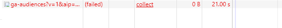
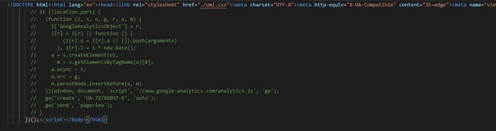
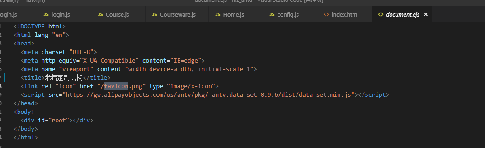
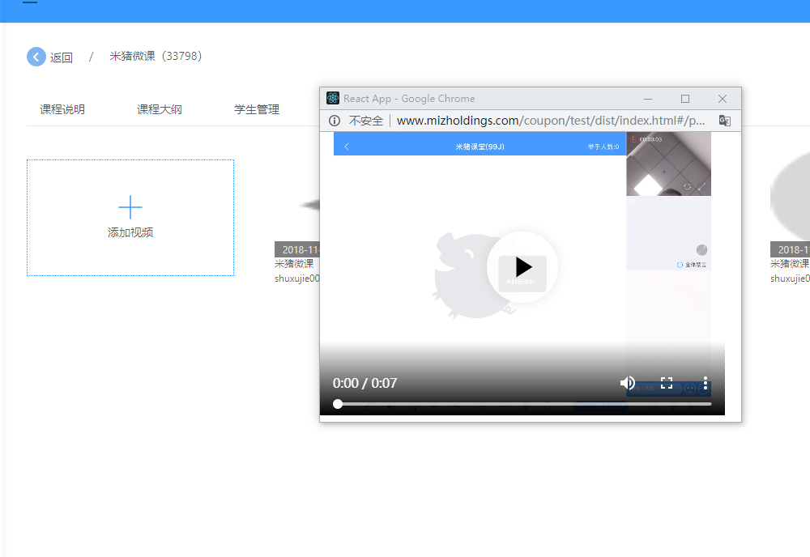

## react 装饰者模式

@withRouter  装饰器模式的写法写高阶函数  
高阶函数：return 的是一个 component
当 babel 版本 <7时
使用 @withRouter 会报错  
**当 babel 版本 <7时**
需要配置 `babel-plugin-transform-decorators-legacy` 插件

- `$ npm install  babel-plugin-transform-decorators-legacy -D`
- 在 .babelrc  里面配置 
    ```
    {
        "plugins": ["transform-decorators-legacy"]
    }
    ```
**当  babel  版本 > 7 时  需要配置**
- `npm install --save-dev @babel/plugin-proposal-decorators`  此时如果使用 powershell 安装会报错  要使用 cmd 命令行安装
- 将以下行添加到.babelrc文件中： 
    ```
    "plugins": [
        ["@babel/plugin-proposal-decorators", { "legacy": true }],
    ]
    ```

## antd -pro   打包之后请求不到 favicon 并且会加载其他文件占用资源



在 localhost 下访问没有问题  打包后测试环境或者线上环境加载不出 favicon 

加载其他文件占用资源解决方案：非本地的域名 会自动加载广告  ，注释掉就ok 了   



favicon 在服务器环境下显示不出来  在ejs什么文件下配置一下路劲就OK



## https 下播放 http的视频解决方案

重新部署一个http的网站  ，  视屏在http的网站上弹出 

